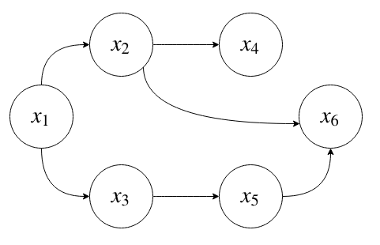
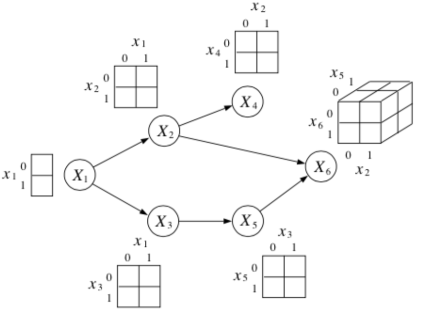
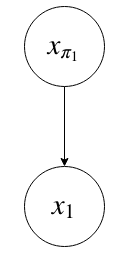
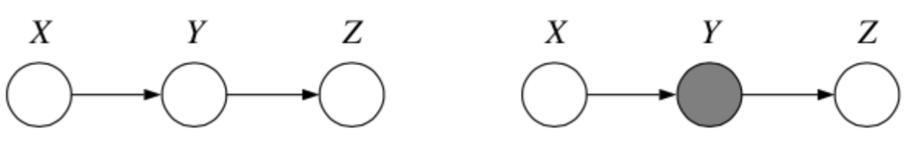
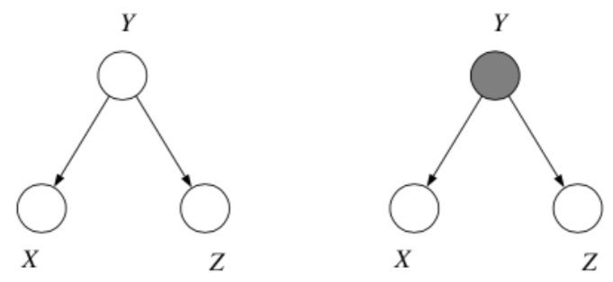
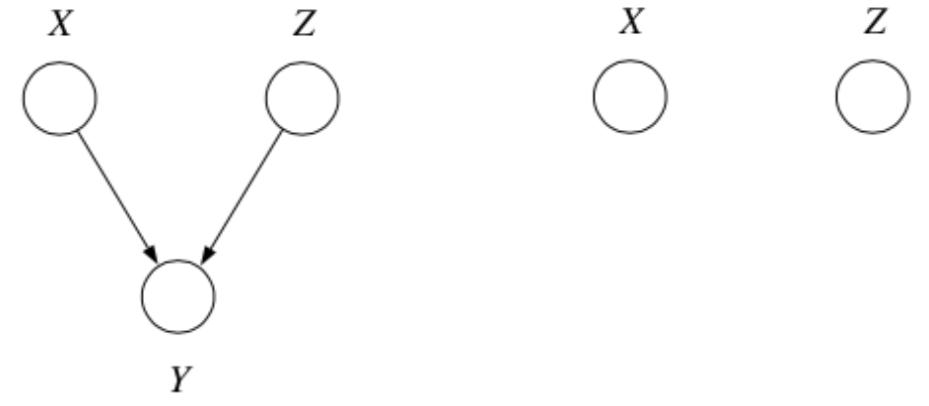

<b>Chapter 2: 概率图模型(Direct Graph Model)

<b>Jinhan Mei 2020 May

#### 2.0 为什么我们要研究概率图模型？

​		在我们开始研究任何模型之前，我们都先必须明确如下这两个问题：我们为什么会提出这个模型？这个模型为我们解决了什么样的问题？

​		对于目前我们局限我们模型最大的问题就是如何去判断输入的各个变量，以及各个变量的”状态(state)“是否相互独立(independent)，我们在Chapter 1有着重讨论过这个问题。那么假设我们现在分析出了各个变量和结果之间的关系：$A\to B \to C \to D$。我们看到其中A影响B，B影响C，C影响D，那么我们需要在模型中加入A对C的影响，A对D的影响，B对D的影响吗？在一个更加复杂的模型中，**我们是不是也许可以通过一些算法免去计算一些状态对另一些的状态的影响，从而把我们在保证不损失模型表达性的情况下最大程度的缩小我们模型的参数呢**？

​		那么对于这个问题的解答，我们相应的提出了**概率图模型**。

#### 2.1 概率图模型的一些假设(Assumptions)

​		在我们研究的概率图模型中，我们将假设研究的是一个**有向无环图模型(Directed Acyclic Graphical Model)**。换言之，在我们本文探讨的事件的“态”中，“状态”和“状态”之间相互的影响是有“方向“的，即：$A\to B $ 为A 影响 B，同时 B 不会影响 A；而且事件的"态"中不存在”环装“影响，即：$A\to B \to C \to A \to B \to ...$ ，不可以存在A 影响 B， B 影响 C， C 反过来重新影响 A 这种”无限循环套娃“的出现。

#### 2.2 联合分布函数 Joint Distribution 的特性的回顾(链式法则Chain rule, 条件独立Conditional Independence)

​		在我们开始进入概率图模型之前，我们先回顾一下关于联合分布函数的一些基本性质，以便于读者更容易理解后面的内容。

1. 一般来讲，对于一个离散的有 $N$ 个自变量的，其中每一个自变量都有 $K$ 个“形态(state)”的联合分布函数来讲，我们一般**需要 $N^K-1$ 个参数**来描述这个联合分布函数。

   

2. 我们可以将一个复杂的联合分布函数分解成为若干个条件概率的乘积。
   $$
   \begin{align*}
   p(x_1,x_2,\dots,x_N)&=p(x_1)p(x_2|x_1)\dots p(x_N|x_1\dots x_{N-1})\\
   &=\prod_{j=1}^Np(x_j|x_1,x_2,\dots,x_{j-1})
   \end{align*}
   $$
   
3. 

$$
\begin{align*}
p(x,y)&=p(y,x)\\
&=p(x|y)p(y)\\
&=p(y|x)p(x)
\end{align*}
$$

4. 对于两个独立的变量，我们有：

$$
p(x_1|x_2)=p(x_1)
$$

5. 在 $X_c$ 的条件下，$X_A$ 与 $X_B$ 条件独立的情况下，我们记作：
   $$
   X_A \perp X_B |X_C
   $$
   

   我们同时会有：
   $$
   \begin{align}
   \iff p(X_A,X_B|X_C) &= p(X_A|X_C)p(X_B|X_C)\\
   \iff p(X_A|X_B,X_C) &= p(X_A|X_C)\\
   &(Note:\ B\ has\ no\ effect\ on\ A\ given\ C)\\
   \iff p(X_B|X_A,X_C) &= p(X_B|X_C)
   \end{align}
   $$
   

#### 2.2 有向无环图模型

​		通过前面的讨论，我们知道对于一个联合分布函数，我们有：
$$
p(x_1,x_2,\dots,x_N)=\prod_{j=1}^Np(x_j|x_1,x_2,\dots,x_{j-1})
$$
​		对于有向无环图模型，我们有：
$$
p(x_1,x_2,\dots,x_N)=\prod_{j=1}^Np(x_j|parents_M(x_i))
$$

​		假设我们现在有如下概率图模型：

​		那么对于 $p(x_1,x_2,x_3,x_4,x_5,x_6)$，我们根据概率图的模型定义有：
$$
p(x_1,x_2,x_3,x_4,x_5,x_6)=p(x_1)p(x_2|x_1)p(x_3|x_1)p(x_4|x_2)p(x_5|x_3)p(x_6|x_2,x_5)
$$
​		假设 $X= \{x_1,..,x_6\}$ 中的每个变量都是二维(Binary)的，那么我们的模型可以表示为：

​		我们可以看到，当 $x$ 的 $parents$ 更多的时候，描述 $p(x)$ 需要的参数也就会越多。那么对于一个有 $K$ 个 parents的 $x$ 来说，我们需要 $2^K$ 个参数去描述 $p(x|parents)$ 的条件概率。假如对于一个全连接的概率图，我们则需要 $2^N-1$个参数来表达。

​		到现在为止，我们通过以上的这个例子对概率图模型和联合分布函数的参数数量有一个直观的了解了。在实际问题中，我们依旧会遇到参数过多，无法求解(infeasible)，或者求解负担过重的问题。在一些情况中，我们采取减少输入或者减少变量的方式来减轻计算负担的思路，有时候也可以得到一个相对准确的估算。

##### 聚合变量(Grouping Variable)

​		在变量图模型中，有时候我们会遇到一长串的影响关系，即：
$$
x_2 \to x_3 \to x_4 \to x_5 \to x_6 \to x_1
$$
​		我们可以将前面的 $\{x_2,x_3,x_4,x_5,x_6\}$ 聚合成为一个更大的变量 $x_{\pi_1}$，所以我们有：
$$
p(x_i,x_{\pi_i}) = p(x_{\pi_i})p(x_i|x_{\pi_i})
$$

#### 使用概率图模型分析贝叶斯统计的条件独立(Conditional Independence)

​		在[Kevin Murphy](https://www.cs.ubc.ca/~murphyk/Bayes/bnintro.html)的书中，我们对贝叶斯统计中的条件独立可以做出以下最简单的判断：**给定一个节点(node)的“父节点(parents)”时，该节点与它的"祖先节点(ancestor)"相互独立**，即：
$$
x_i\perp x_{\hat{\pi_i}}|x_{\pi_i}
$$

​		一般来讲，缺少边的情况一般都会伴随着条件独立。更多更详细的情况我们会在接下来的文中我进行更详细的讨论。

##### 条件独立的几种简单情况

1. **Chain**

   

问：假如我们知道Y， 那X和Z独立吗？

​		通过上图我们可以知道：
$$
P(x,y,z) = P(x)P(y|x)P(z|y)
$$
​		那么：
$$
\begin{align}
P(z|x,y) &= \frac{P(x,y,z)}{P(x,y)}\\
&=\frac{P(x)P(y|x)P(z|y)}{P(x)P(y|x)}\\
&=P(z|y)
\end{align}
$$
​		所以我们可知：$x\perp z|y$。换言之，未来的事情只和现在有关，与过去无关。

2. **Common Cause**

   

   ​	假如我们认为 $Y$ 对 $X,Z$ 同时起到影响，那么在已知 $Y$ 的情况下，$X,Z$ 相互独立吗？

   ​	通过上图我们可以知道：
   $$
   P(x,y,z) = P(y)P(x|y)P(z|y)
   $$
   ​	那么：
   $$
   \begin{align}
   P(x,z|y) &= \frac{P(x,y,z)}{p(y)}\\
   &=\frac{P(y)P(x|y)P(z|y)}{P(y)}\\
   &=P(x|y)P(z|y)
   \end{align}
   $$
   ​	所以说我们可知： $x\perp z|y$。换言之，假如你因为感冒流鼻涕和拉肚子，那么流鼻涕和拉肚子都只和感冒有关，流鼻涕和拉肚子没有关系，拉肚子也和流鼻涕没有关系。

3. **Explaining Away**

   

   ​	假如现在我们知道 $X,{Z}$ 共同影响 $Y$, 那么在已知 $Y$ 的情况下，$X,Z$ 相对独立吗？

   ​	通过上图我们可以知道：
   $$
   P(x,y,z)=P(x)P(z)P(y|z,x)
   $$
   ​	那么：
   $$
   \begin{align}
   P(z|x,y) &= \frac{P(x)P(z)P(y|x,z)}{P(x)P(y|x)}\\
   &=\frac{P(z)P(y|x,z)}{P(y|x)}\\
   &\neq P(z|y)
   \end{align}
   $$
   

   ​		所以我们可知：$x\not\perp z|y$。换言之，假如你同时扔两枚硬币，并且已知结果只有一个正面。那么第一枚扔的硬币A的结果和第二枚扔的硬币B的结果就不是相互独立的。因为如果第一枚硬币投出的是正面，那么第二枚硬币就必然是反面；反之亦然。这种“两个本来无关的变量之间体现出貌似强烈的相关关系”的现象也被成为[伯克森悖论](https://www.zhihu.com/question/317966300/answer/635982612)，用来解释基于对受到限制样本的观察，常常成为日常生活和学术研究中获得错误结论的现象。

##### 条件独立的组合情况：贝叶斯球算法

​		到目前为止，我们对概率图模型有了一个比较直观的认识，并且对一些简单的条件独立的情况有了一个了解。我们下一个研究的问题是：在关系比较复杂的概率图模型中，我们该如何去判断几个时间是否为条件独立呢？显然目前拥有的简单条件独立的判断标准不足以为我们做出判断，那么我们现在就引入了相对更“强大”的判断算法——贝叶斯球算法。

​		关于贝叶斯球的算法详解，我们在这里借用CSDN的“__鸿”的一篇[博客](https://blog.csdn.net/u014313009/article/details/39780847)代为解释。我们在这里只对两个例子做简单的讨论。

问题1：$x_1\perp x_6|\{x_2,x_3\}?$

​		根据贝叶斯球算法，我们可知：$x_1\perp x_6|\{x_2,x_3\}$

问题2：$x_2\perp x_3∣\{x_1,x_6\}?$	

​		根据贝叶斯算法，我们可知$x_2 \not\perp x_3∣\{x_1,x_6\}$

