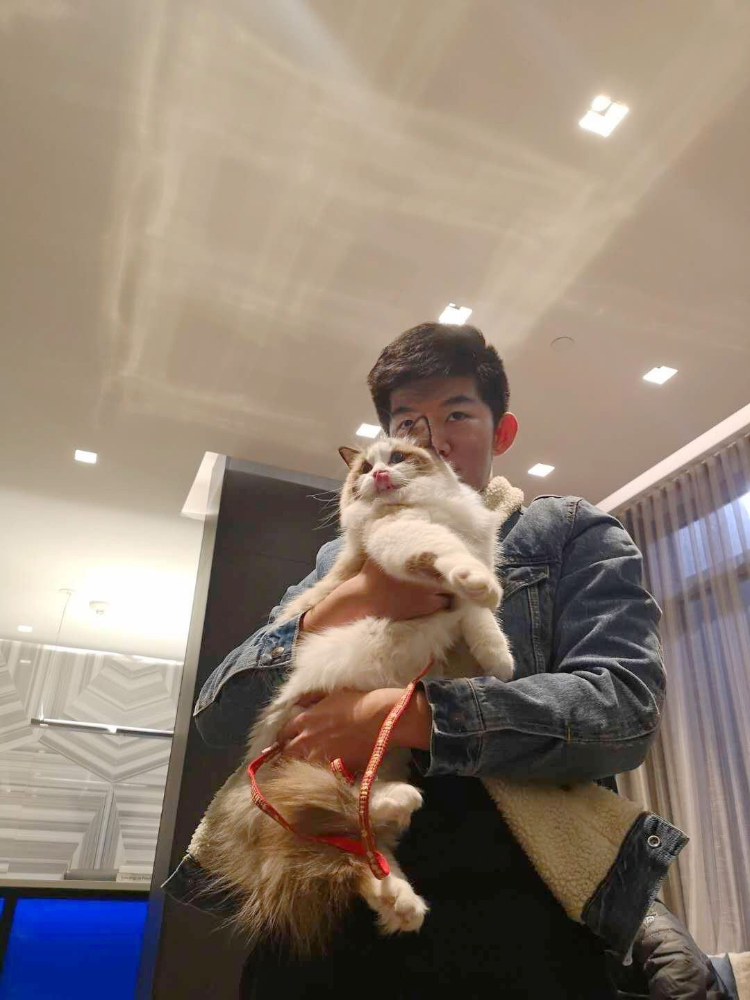

Jinhan Mei 梅锦涵

### About me

​		Hi, I am Jinhan, a student in 4th year in University of Toronto. I am a student  majored in Math and Statistics, and minored in Computer Science. My focus is in Machine Learning, and Data Science. Besides, I also have great interest in Mathmatical Finance. 

​		 I am currently living in my hometown, Beijing, due to COVID-19. I found a lot of algorithm tutorial, and implementation online is not clear, or not correct at all. So I decide to write my own webpage, summarzing all the algorithm I have learnt, and giving a correct to implementation in Python, or R. 

​		This is my [webpage](/balabla) for my summation of algorithms in Machine Learning I have learnt. If you found any problem, you can contact me either through email or wechat, I will give a response as soon as possible.

​		Also, I am preparing my skills to become a full-stack programmer, or maybe a data scienist, at FANNG, or BBAT. If you are willing to a project, or have a job, you can also get in touch with me via email or wechat. my resume is at [here](balabal). I will be glad if you can help me.

​		In the end, thanks for visiting my website, I hope my tutorial of machine learning can help you! Cheers!