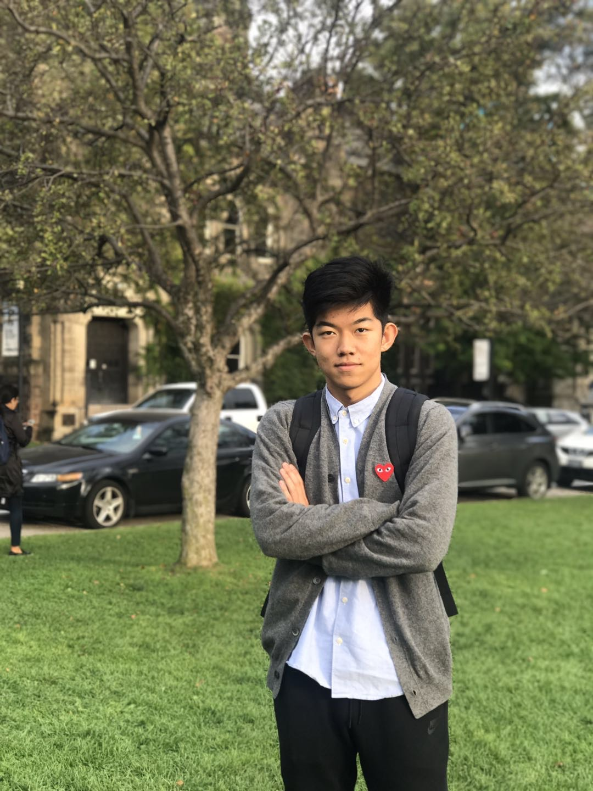

Jinhan Mei 梅锦涵

### About me

​		Hi, I am Jinhan, a student in 4th year in University of Toronto. I majored in Math and Statistics, and minored in Computer Science, focusing on Machine Learning and Data Science, and  I have great interest in Mathmatical Finance as well. 

### Current Project

  1. Machine Learning Algorithm tutorial and implementation website. [Take me to tutorial](Tutorial_Page.html)

     ​		I am working on this because I found a lot of tutorial is counterintuitive. It talks too much about the Math and Statistics behinds the algorithm, making people only remember the derivation of the Math, and forget why we need the algorithm itself. Besides, I found a lof of the code of the implementation of the algorithm is not correct, or it will fails at corner cases. As a result, I decide to write my own tutorial to help learn the algorithm and see how it can be implemented.

     ​		Now we have tutorial of:

     * [Support Vector Machine or SVM](SVM_EN.html)

     * Bayes (Comming soon)

     * Time Series (Comming soon)

     * Regressions (Comming soon)

       

		2. Building Statistics model for a Plutonomy Graduate paper about LME and CME for my friend.

     ​		I am trying to use what I learnt in last few years to help my friend, a Art student at King's College London, to build a model for her paper applying P.h.d at oxford.

     

		3. Practing skills for a job at FANNG or BBAT.

### Contact me

​			If you have any **concerns**, **job position**, or **looking for build a project together**, you can contact me personally via either email or wechat.

* email: meijinhan0819@gmail.com

* wechat:1814292527